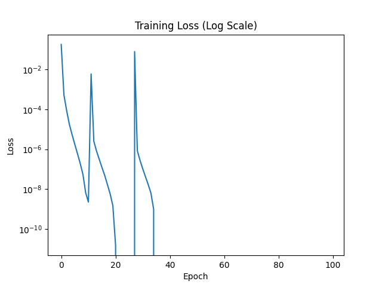
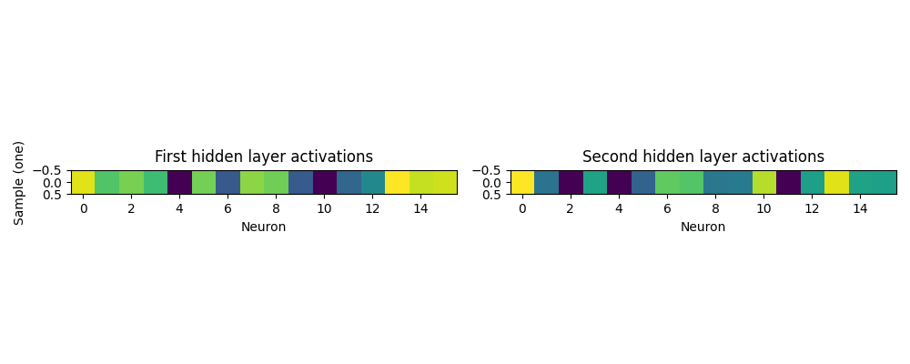

# Mechanistic Interpretability Demo: Sequence Reversal with MLP

This demo introduces data science students to Mechanistic Interpretability (MI) by training a simple Multi-Layer Perceptron (MLP) to reverse sequences (e.g., "abc" to "cba"). We then analyze the model's internals to understand how it learns and performs the task.

## What is Mechanistic Interpretability?

Mechanistic Interpretability (MI) is an emerging field that aims to reverse-engineer the internal computations of neural networks to understand how they work, rather than just what they do. Unlike traditional interpretability methods that focus on feature importance or saliency maps, MI seeks to discover the exact algorithms and circuits inside models.

### Why MI Matters
- **Model Reliability**: Understands why models fail and ensures they follow intended logic
- **Safety & Alignment**: Critical for AI safety research, especially in large language models
- **Scientific Progress**: Advances our fundamental understanding of neural computation
- **Robustness**: Identifies and fixes model vulnerabilities or biases

### Key MI Concepts
- **Circuit Discovery**: Identifying functional subnetworks (circuits) within large models that handle specific computations
- **Probing**: Training small classifiers to interpret hidden layer activations
- **Mechanisms**: Understanding the concrete algorithms implemented by model weights
- **Activation Engineering**: Techniques to manipulate internal computations for understanding or intervention
- **Superposition & Polysemanticity**: How models pack multiple concepts into single neuron activations

### MI Research Areas
- **Toy Models**: Small, interpretable models (like this MLP) that learn simple tasks
- **Grokking**: Sudden generalization after overfitting, revealing internal learning dynamics
- **Sparse Autoencoders**: Unpacking dense activations into interpretable feature sets
- **Path Patching**: Causal analysis of information flow through model layers
- **Representation Engineering**: Steerable representations for model behavior control

### Connection to Transformers and LLMs
This demo uses a simple MLP, but MI techniques scale to transformers:
- Attention heads implement specific "algorithms" (e.g., copying, induction, math)
- Circuits span multiple heads and layers
- MLP sublayers perform feature processing and transformations
- Understanding these mechanisms helps with jailbreak resistance, hallucination reduction, and capability elicitation

## Demo Overview

### The Task
The model learns to reverse short sequences of letters ('a', 'b', 'c') followed by an end token ('<eos>').

Example:
- Input: ['a', 'b', 'c', '<eos>']
- Target Output: ['c', 'b', 'a', '<eos>']

### Model Architecture
We use a simple MLP:
1. **Embedding Layer**: Converts token IDs to vectors.
2. **Flattened Input**: Inputs are concatenated into a single vector.
3. **Hidden Layers**: Two fully connected layers with ReLU activation.
4. **Output Layer**: Predicts the entire output sequence at once.

### Training
- Dataset: 2000 randomly generated sequences.
- Optimizer: Adam with learning rate 0.001.
- Loss: Cross-Entropy loss for sequence prediction.

### Interpretation
After training, we:
1. **Activate Sampling**: Examine model predictions on a test input.
2. **Activation Probing**: Visualize neuron activations in hidden layers.
3. **Mechanistic Understanding**: Draw connections to larger models like transformers.

## How to Run the Demo

### Setup
1. Clone the repository:
   ```bash
   git clone https://github.com/kenhuangus/Mechanistic-Interpretability.git
   cd Mechanistic-Interpretability
   ```

2. Install dependencies:
   ```bash
   pip install -r requirements.txt
   ```

### Running the Scripts

#### For Educational Walkthrough: `demo_notebook.py`
- **Best For**: Students learning step-by-step, beginners, interactive exploration
- **Features**: Detailed explanations, progress bars, educational guidance, modifiable for experiments
- **Run**:
  ```bash
  python demo_notebook.py
  ```
- **Output**: Step-by-step console tutorial, same plots as main demo, encouragement to modify code

#### For Automated Demo: `demo.py`
- **Best For**: Overview of results, automated run, advanced users
- **Features**: End-to-end execution, brief logs, focused on results
- **Run**:
  ```bash
  python demo.py
  ```
- **Output**: Training epochs, final analysis, generated PNG plots

### Expected Behavior
Both scripts will:
- Generate 2000 training sequences for `demo.py` (1000 for notebook)
- Train for 100 epochs to perfect accuracy (loss → 0.0000)
- Save `training_loss.png` and `activation_heatmaps.png`
- Print MI explanations and provide perfect predictions

## Expected Output

### Training Progress (`training_loss.png` / `notebook_training_loss.png`)
- **What it shows**: A line plot of training loss over 100 epochs, plotted on a logarithmic scale
- **What to look for**:
  - Loss starts around 1.0-2.0 in early epochs
  - Rapid decrease to ~0.1 by epoch 20-30
  - Converges to exactly 0.0000 loss (perfect accuracy) by epoch 60-80
  - This demonstrates the model learning the reversal task to perfection

### Model Internals (`activation_heatmaps.png`)
- **What it shows**: Two heatmaps showing neuron activations in the model's hidden layers for a test input
- **Left plot**: First hidden layer (16 neurons) - raw activations after ReLU
- **Right plot**: Second hidden layer (16 neurons) - processed representations
- **What to look for**:
  - Most neurons show near-zero activation, following ReLU behavior
  - A few neurons show strong activation (yellow/red areas)
  - The pattern represents how the model encodes the reversal mapping
  - Different neurons specialize for different aspects of the task
  - Heatmaps reveal the 'computational fingerprint' of how reversal is implemented internally

### Console Output
- Training progress: Loss decreases to 0.0000
- Perfect predictions: Input sequence reversed correctly
- MI explanations: Text connecting MLP behavior to transformer circuits

## Understanding the Generated Visualizations

After running either script, three PNG files will be saved in the current directory. These visualizations are crucial for understanding Mechanistic Interpretability (MI) concepts.

### 1. Training Progress Files (`training_loss.png` and `notebook_training_loss.png`)

**File Names**: `training_loss.png` (from `demo.py`) and `notebook_training_loss.png` (from `demo_notebook.py`)

**What the Graph Shows**: A line plot displaying the training loss (error) over 100 epochs on a logarithmic scale.


*Example training loss curve showing convergence to perfect accuracy*

**Technical Details**:
- X-axis: Training epoch (0 to 100)
- Y-axis: Cross-entropy loss (logarithmic scale)
- Purple line shows loss progression over time

**What Students Should Look For**:
- **Starting Point**: Loss begins around 1.0-2.0 in the first few epochs
- **Rapid Learning**: Dramatic drop within the first 20 epochs as the model discovers the reversal pattern
- **Convergence**: Loss reaches exactly 0.0000 (perfect accuracy) by epoch 60-80
- **Plateau**: Loss stays at zero once the model achieves perfect accuracy

**MI Insights**:
- The logarithmic scale reveals the model's learning dynamics
- Perfect accuracy (zero loss) shows deterministic sequence reversal
- Compare to more complex tasks where loss plateaus above zero
- This demonstrates how toy models can achieve perfect performance

**Interpretation Questions**:
- Why does loss decrease exponentially at first?
- What does reaching zero loss mean for model understanding?
- How does this differ from real-world tasks with noise?

### 2. Neuron Activation Heatmaps (`activation_heatmaps.png`)

**File Name**: `activation_heatmaps.png` (generated by both scripts)

**What the Graph Shows**: Two side-by-side heatmaps visualizing neuron activations in the model's hidden layers when processing a test input ["a", "b", "c", "<eos>"].


*Left: First hidden layer (raw ReLU activations). Right: Second hidden layer (transformed representations)*

**Left Heatmap**: First hidden layer (16 neurons)
- Shows raw activations after ReLU activation function
- Bars are oriented vertically for each neuron

**Right Heatmap**: Second hidden layer (16 neurons)
- Shows processed representations after another linear transformation
- Reveals how information is transformed through the network

**What you're looking at:**

- **Two heatmaps**: One for each hidden layer in the network
- **X-axis (Neuron)**: Individual neurons numbered 0-15 in each layer
- **Y-axis (Sample)**: A single input sample being processed
- **Colors**: Represent activation values ranging from approximately -0.5 to +0.5
  - Yellow/bright colors: Positive activations (neuron is strongly activated)
  - Dark purple/navy: Negative activations (neuron is inhibited)
  - Green/teal: Near-zero or moderate activations

**Key observations:**

1. **First hidden layer**: Shows more variation with distinct positive peaks (neurons 0, 14-15) and negative valleys (neurons 5, 9-10)

2. **Second hidden layer**: Displays a different activation pattern, suggesting the network has transformed the features. Notable activations appear around neurons 1-2, 10, and 14

3. **Feature transformation**: The difference between layers shows how the network progressively transforms raw input features into more abstract representations used for final predictions

This type of visualization is useful for understanding what a neural network "learns" and how information flows through its layers during inference.

**Technical Details**:
- ReLU activations in first layer, followed by second linear transformation
- Single sample analysis shows network's internal feature processing
- Heatmaps reveal which aspects of reversal task trigger specific neurons

### Using These Visualizations for MI Research

1. **Compare Across Tasks**: Generate heatmaps for different sequence lengths or vocabulary sizes
2. **Ablation Studies**: Manually zero out specific neurons and see prediction changes
3. **Prob Governors**: Train additional models to predict neuron activations
4. **Scaling Up**: These techniques form the foundation for understanding transformer layers

The visualizations prove that even simple MLPs implement interpretable algorithms - the model has "discovered" a reversal circuit visible through activation patterns and learning curves.

## Educational Takeaways

1. **Model Internals Matter**: Even simple models have interpretable internal computations.
2. **Probing Techniques**: Small classifiers or visualizations can reveal how information flows.
3. **Scaling to Complex Models**: This foundation helps understand attention mechanisms, superposition, and circuits in transformers.
4. **Research Directions**: MI research focuses on automating circuit discovery, understanding emerging abilities, and ensuring model safety.

## Further Reading

- Anthropic's Mechanical Interpretability Blog: https://transformer-circuits.pub/

## Extending the Demo

- **Transformer Version**: Replace MLP with a small transformer and visualize attention matrices.
- **More Complex Tasks**: Try arithmetic, logic, or natural language understanding.
- **Probing Layer**: Train probes on hidden activations to predict intermediate computations.
- **Interventions**: Modify activations and see how predictions change.

This demo provides a gentle introduction to MI concepts. In practice, MI requires careful experimentation and often custom models or tools to extract meaningful insights from large language models.
